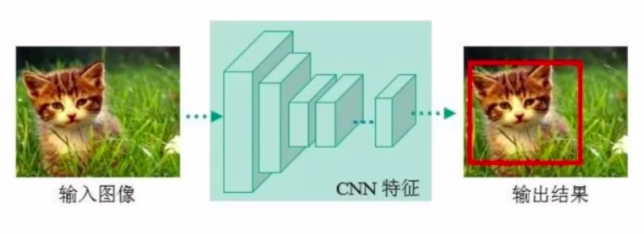
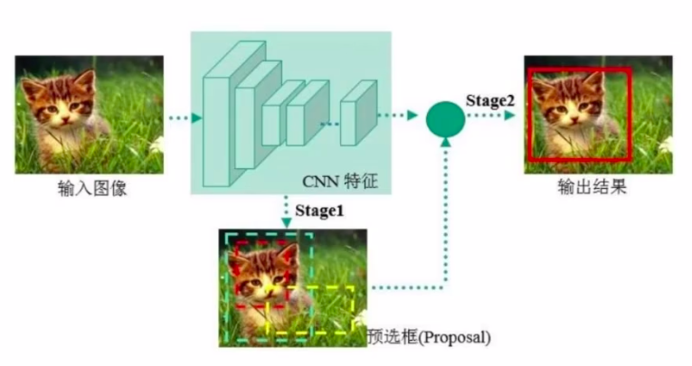
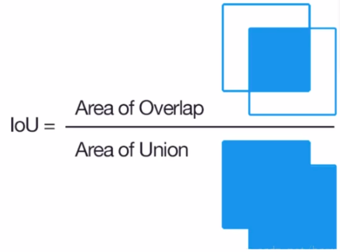
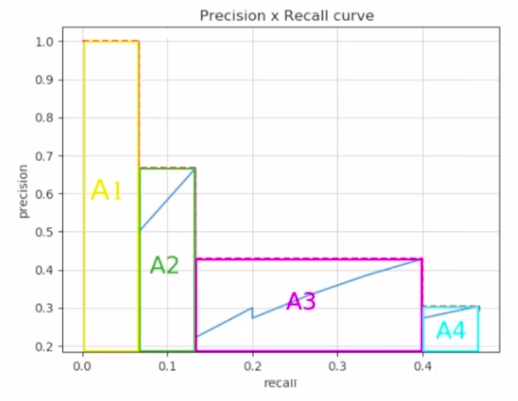
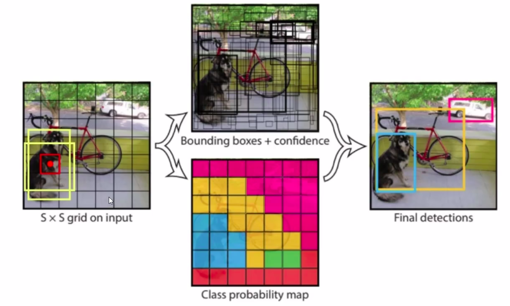
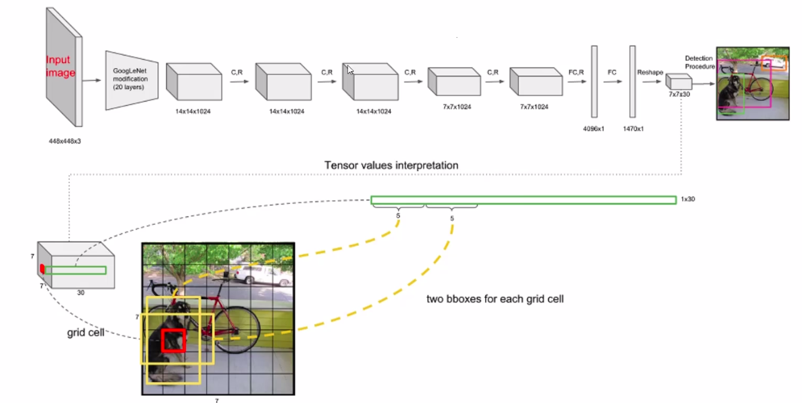
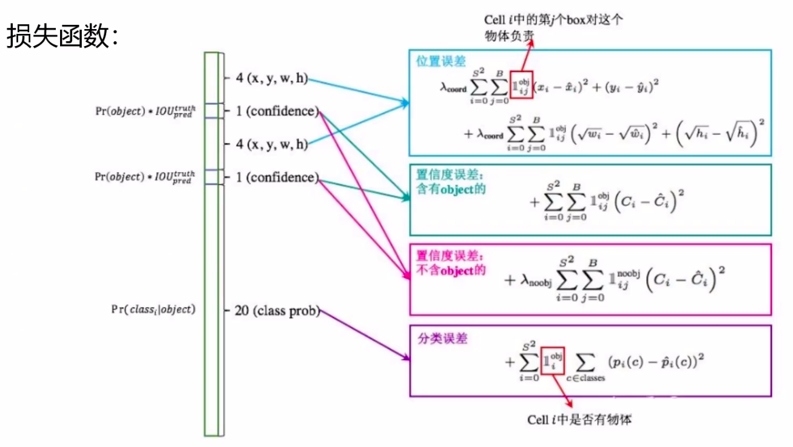

# 1. 问题
## 1.1 one-stage 与 two-stage的区别和联系是什么？如何定义one-stage与two-stage?

## 1.2 MAP指标，单看精度和recall不行吗？
Recall: 原始图像中，是不是每一个都检测到了。精度：每个框是否和真实值极度吻合。

## 

# 2. Stage.  

下图是one-stage的算法，可理解为一个神经网络输出一个回归（分类）结果。

  

下图是two-stage的算法，可以理解为在输出回归（分类）结果前，先进行一波预筛选。

  

   

## 2.1 区别和优缺点
one-stage:   
1. 速度非常快
2. 通常情况效果不太好  

FPS: frame per second.  

# 3. Map
Map: 检测任务中经常提到的指标。Map越大，检测效果越好。综合衡量检测效果。  
## 3.1 IOU
Intersection of unit.

  

   

$$
Precision = \frac{TP}{TP+FP}
$$
$$
Recall = \frac{TP}{TP+FN}
$$

## 3.2 Map
Map综合考虑P-R参数，得到的结果

  

 

# 4. YOLO
## 4.1 YOLO-v1
yolov1中只有2中候选框，并从两个候选框中选择一个，然后进行微调。在预测时，除了框的几何参数，还有一个置信度，最后要将置信度小的框过滤掉。

  

 

### 4.1.1 网络
yolov1的网络架构如下：

  

   

特征图全连接层转化为4096*1，然后再连接一个1470*1的全连接网，再reshape成7*7*30，生成7*7的格子，每个格子中预测出30个值。  
举例：生成一个框，Box1: x1, y1, w1, h1, c1，其中x1, y1不是图片中的坐标值，而是经过整个图像归一化后的0到1的值，表示相对整个图像中的位置，c1表示置信度。  
30个参数，那么Box1 + Box2有10个参数，剩下的20，表示在此数据集中，有20个分类。  
最终网格的大小 （S * S）*(B*5+C)
### 4.1.2 损失函数

  

$$
L = L_1 + L_2 + L_3
$$

#### 4.1.2.1 位置误差
位置误差损失函数如下：
$$
L_1 = \lambda_{coord}\sum_{i=0}^{S^2}\sum_{j=0}^{B}\amalg_{ij}^{obj}(x_i-\hat{x_i})^2 + (y_i - \hat{y_i})^2 + \lambda_{coord}\sum_{i=0}^{S^2}\sum_{j=0}^{B}\amalg_{ij}^{obj}(\sqrt{w_i} - \sqrt{\hat{w_i}})^2 + (\sqrt{h_i} - \sqrt{\hat{h_i}})^2
$$  
其中$S^2$在yolov1中表示最后网络输出的7*7*30中的 __7*7__ , B 表示2个框，$\amalg$ 表示在两个候选框中选择IOU计算后更贴切的那个框。 $\sqrt{w_i}-\sqrt{\hat{w_i}}$ 的计算，与坐标点，$x_i, y_i$ 不同的原因是，减小因为框的大小导致的最小二乘损失函数所引起的不好的影响。如 5 *5 的框误差值为1和 1 * 1 的框，误差值为1的严重程度应该是不一样的，当数值小的时候，变化敏感，数值较大时，变化不那么敏感。解决对小物体检测不敏感的问题。
#### 4.1.2.2 置信度误差
置信度误差如下：  
包含障碍物的损失函数：
$$
L_{21} = \sum_{i=0}^{S^2}\sum_{j=0}^{B}\amalg_{ij}^{obj}(C_i-\hat{C_i})^2
$$
背景信息的损失函数:
$$
L_{22} = \lambda_{noobj}\sum_{i=0}^{S^2}\sum_{j=0}^{B}\amalg_{ij}^{obj}(C_i-\hat{C_i})^2
$$
$$
L_2 = L_{21} + L_{22}
$$
#### 4.1.2.3 分类损失函数
$$
L3 =  \sum_{i=0}^{S^2}\amalg_{ij}^{obj}\sum_{c\in{classes}}(p_i(c)-\hat{p_i}(c))^2
$$

### 4.1.3 非极大值抑制
多个候选框，选择置信度最大的框

### 4.1.4 问题
1. 无法检测重合在一起的物体，由其算法选择2个Box导致的？-> TODO
2. 没有考虑的小物体的检测，长宽比的选择单一

## 4.2 YOLO-V2
### 4.2.1 迭代更改点
1. 舍弃dropout，卷积后全部加入Batch Normalization
2. 网络的每一层的输入都做归一化，收敛更加容易  
3. 经过BN的网络会有2%的提升
4. 使用了更大的分辨率